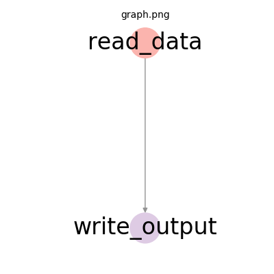

# DAG Configurations

In `primrose`, you run a job by defining a `directed acylic graph`, hereafter `DAG`, with a configuration file.

Graphs consists of two components:

 - **nodes**: these are the individuals steps (actually classes) that need to be run, such as a `CsvReader` or `DecisionTreeModel`.

 - **edges**: these are the dependencies among nodes, and typically (but not always) involve a flow of data from the source node to the destination node. For instance, you may need a reader to run, and for the data to flow to a downstream writer so that it can be written out. In this case, you define an edge from the reader to a writer. All edges are directed.

    An edge, however, may not require a data flow. For instance, a writer (which might represent the last actual work step of a DAG) might connect to a final success step to track the DAG completion. That success step might not need any data other than a signal that it is its turn to fire.

 Here is a very simple DAG consisting of a reader node flowing to a writer node with a single directed edge:

 

 # Configuration Files

 `primrose` configuration files can be defined using `json` or `yaml` format. This guide will detail `json` style configuration, but feel free to view example `yaml` configurations in the [config](./config) directory.

 At the highest level, configuration files consists of two sections:

  - **metadata** section. This section is *optional* and contains the data that defines any global (job-level) parameters. This section is documented [here](README_METADATA.md).

  - **implementation** section. This *required* section  contains the actual DAG definition.

This is the highest level skeleton of a configuration file:
```
{
    "metadata": {},
    "implementation_config": {}
}
```

The typical flow of a machine learning job is 

```
readers --> pipelines --> models --> postprocess --> writers --> success
```

and so configuration files tend to gather nodes of a particular type into a section. Readers are defined within a `reader_config` section, pipelines nodes are defined within a `pipeline_config` section etc.

Importantly, these sections are optional. That is, you can have 0 or 1 of each of `reader_config`, `pipeline_config`, `model_config`, `postprocess_config`, `writer_config`, and `success_config`.

Here is an example configuration consisting of a single reader node flowing into a writer node. There is a single `reader_config` and a single `writer_config` and no other sections.

```
{
    "implementation_config": {
        "reader_config": {
            "read_data": {
                "class": "CsvReader",
                "filename": "data/tennis.csv",
                "destinations": [
                    "write_output"
                ]
            }
        },
        "writer_config": {
            "write_output": {
                "class": "CsvWriter",
                "key": "data",
                "dir": "cache",
                "filename": "tennis_output.csv"
            }
        }
    }
}
```

If you wish to have sections other than `reader_config`, `pipeline_config`, `model_config`, `postprocess_config`, `writer_config`, or `success_config`, you can do so but you will need to register them in the metadata section. Please see [Configuration Metadata](README_METADATA.md) for full details.

## Section Order
The order of the sections within `implementation_config` is not important and does not impact the order of operations. Thus, 

```
{
    "implementation_config": {
        "writer_config": {
            "write_output": {
                "class": "CsvWriter",
                "key": "data",
                "dir": "cache",
                "filename": "tennis_output.csv"
            }
        },
        "reader_config": {
            "read_data": {
                "class": "CsvReader",
                "filename": "data/tennis.csv",
                "destinations": [
                    "write_output"
                ]
            }
        }
    }
}
```
is valid and defines the same DAG---a reader flowing to a writer---as the earlier example. This is true because the edges are all directed. What defines the DAG is not the sections but the nodes and directed edges, the underlying graph, here `read_data node --> write_output node`.

## Node Definitions
In the example above, we defined two DAG nodes: a reader node and a writer node. Let's examine the `reader_config` section:

```
    "reader_config": {
        "read_data": {
            ...
        }
    }
```

### Node Names
`reader_config` (and is true of all sections) is a dictionary. Its keys are the names of the nodes. Thus, within `reader_config` we have a single key, `read_data`. So, we have one DAG node in `reader_config` and it is called `read_data`.

The `read_data` node defines a dictionary. All nodes are defined by dictionaries.

### Class Key
Every node definition *must* contain a class key. This defines the string, typically the class name, that is registered with the `NodeFactory`, and specifies which class we wish to run at this point in the DAG.

```
    "read_data": {
        "class": "CsvReader",
        ...
    }
```

### Destinations Key
`read_data` also specifies a list `destinations`. This is the key that specifies the edges. Destinations, as the name suggests, is the list of other node names, that data from this node should flow to.

In the example above `read_data` specifies that it has an edge connecting to the node named `write_output`

```
    "read_data": {
        ...
        "destinations": [
            "write_output"
        ]
    }
```

`destinations` may be an empty list:

```
    "destinations": []
```

or it may be missing completely, as in the `write_output` node above.

As you might expect, the names listed within the `destinations` list must be valid names of nodes within the DAG. Moreover, they must not be node names that would create cycles within the graph. 

For instance, this would **not** be a valid DAG:

```
{
    "implementation_config": {
        "reader_config": {
            "read_data": {
                ...
                "destinations": [
                    "write_output"
                ]
            }
        },
        "writer_config": {
            "write_output": {
                ...
                "destinations": [
                    "read_data"
                ]
            }
        }
    }
}
```

as `read_data` -> `write_output` -> `read_data` is a cycle.

### Other Special Required Keys

Pipeline-type nodes require an `is_training` key with a value one of:
 - `true`
 - `false`

Model-type nodes require a `mode` key with a value one of:
 - `train`
 - `predict`
 - `eval`

### Other Class-Specific Keys
Nodes may define keys other than `class`, `destinations`, `is_training`, and `mode` that they need to fully parameterize their operation. For instance, in the `read_data` node, of type `CsvReader`

```
    "read_data": {
        "class": "CsvReader",
        "filename": "data/tennis.csv",
        "destinations": [
            "write_output"
        ]
    }
```
we find a `filename` key. This makes sense, a `CsvReader` has to know the path to the file it must read from.

Each node class may define a set of additional required keys. Those are defined in the `necessary_config()` method of the class implementation. To find out which keys are needed, you can 
 - attempt to run the job with the configuration file and the validation process will tell you which keys are necessary but missing.
 - examine other example configuration files
 - examine the source code of the class.

Other nodes may require many more additional fields than the single `filename` key above. For instance, in this `DecisionTreeModel`-type node, four other keys are required: `seed` (to make the job reproducible), `train_percent` (to define the train-test split percentage), `y` (the target or dependent variable), and `X` (the features that define the feature matrix). 
```
    "decision_tree_model": {
        "class": "DecisionTreeModel",
        "seed": 42,
        "train_percent": 65.0,
        "y": "play",
        "X": [
            "outlook",
            "temp",
            "humidity",
            "windy"
        ],
        "mode": "precict",
        "destinations": [
            "write_output"
        ]
    }
```

Nodes may require other keys that are not required but are optional. For those keys, you will need to examine other configuration files or examine the source code.

# Comments
### YAML
The `yaml` specification already provides support for commenting. Just use the `#` character to comment:

```
# this is a comment
# this is too

implementation_config:
  # another comment
  reader_config:
    read_data:
      class: CsvReader
      destinations:
      - write_output
      filename: data/tennis.csv # inline comment
  writer_config:
    write_output:
      class: CsvWriter
      dir: cache
      filename: tennis_output.csv # more comments
      key: data
```

### JSON
`primrose` also supports javascript style comments in `json` configuration files. By making use of the `jstyleson` library, it supports `/*...*/` and `//` style comments:
 - single-line comment
 - multi-line comment
 - inline comment
 - trailing comma

Thus,

```
{
    /*
     *  this is a comment
     */

    "implementation_config": {
        "reader_config": {
            "read_data": {
                "class": "CsvReader",
                "filename": "data/tennis.csv",
                "destinations": [
                    "write_output"   /* more comments */
                ]
            }   
        },
        "writer_config": {
            "write_output": {
                "class": "CsvWriter", // an inline comment
                "key": "data",
                "dir": "cache",
                "filename": "tennis_output.csv"
            }
        }
    }
}
```
will be parsed correctly as a JSON configuration.

# Configuration File Fragment Substitution
There are times when you may have a section of a configuration file that represents some coherent chunk of functionality that you would like to reuse in multiple configurations. `primrose` supports the ability to bring in that configuration fragment using string substitution. 

It looks for the presence of `$$FILE=some/path/to/configuration/fragment.json$$` in your file.

This is more easily explained with an example. 

Suppose you have the following configuration file:
```
    {
        $$FILE=test/metadata_fragment.json$$
        "implementation_config": {
            $$FILE= test/read_write_fragment.json $$
        }
    }
```
and `test/metadata_fragment.json` is
```
        "metadata":{},
```
and `test/read_write_fragment.json` is
```
            "reader_config": {
                "read_data": {
                    "class": "CsvReader",
                    "filename": "data/tennis.csv",
                    "destinations": [
                        "write_output"
                    ]
                }
            },
            "writer_config": {
                "write_output": {
                    "class": "CsvWriter",
                    "key": "data",
                    "dir": "cache",
                    "filename": "tennis_output.csv"
                }
            }
```
`primrose` will swap `$$FILE=test/metadata_fragment.json$$` with the contents of `test/metadata_fragment.json` and it will swap `$$FILE= config/read_write_fragment.json $$` with the contents of `config/read_write_fragment.json` to produce:
```
    {
        "metadata":{},
        "implementation_config": {
            "reader_config": {
                "read_data": {
                    "class": "CsvReader",
                    "filename": "data/tennis.csv",
                    "destinations": [
                        "write_output"
                    ]
                }
            },
            "writer_config": {
                "write_output": {
                    "class": "CsvWriter",
                    "key": "data",
                    "dir": "cache",
                    "filename": "tennis_output.csv"
                }
            }
        }
    }
```
Note: the final configuration will go through the normal validation process (see below) and it is up to the user to make sure that the destinations listed in the fragments line up with the rest of the configuration correctly.

# Configuration File Validation
When you run, or attempt to run, a job using
```
  primrose run --config path/to/your/config.json
```

a validation process kicks in to validate as much of the configuration file as possible.

The list below is not exhaustive but, for instance, this process will check:
 - that a single `implementation_config` key exists
 - that it recognizes the sections (either they are the default `reader_config`, `pipeline_config` etc. or they are user-defined sections registered in the metadata section)
 - that node names are unique
 - that each node contains a `class` key
 - that the value specified for `class` key is a recognized, registered class
 - that the required additional keys for a node are present
 - the `destinations` point to known node names
 - that the DAG does not have cycles
 - that if a `metadata` section is present, it meets a set of requirements. See [Configuration Metadata](README_METADATA.md) for details on its keys.

## When Validation Passes

 When you run the job, the job will log the checks being made, such as

 ```
 primrose run --config config/hello_world_read_write.json

2019-07-12 20:56:36,601 INFO configuration.py __init__: Loading config file at config/hello_world_read_write.json
2019-07-12 20:56:36,601 INFO configuration.py check_sections: OK: all sections are supported operations
2019-07-12 20:56:36,602 INFO configuration.py check_config: OK: all class keys are present
2019-07-12 20:56:36,602 INFO configuration.py check_config: OK: all classes recognized
2019-07-12 20:56:36,602 INFO configuration.py check_config: OK: good necessary_configs
2019-07-12 20:56:36,602 INFO configuration_dag.py create_dag: Checking configuration DAG
2019-07-12 20:56:36,602 INFO configuration_dag.py create_dag: OK: good referential integrity
2019-07-12 20:56:36,602 INFO configuration_dag.py check_connected_components: OK: 1 connected component
2019-07-12 20:56:36,602 INFO configuration_dag.py check_for_cycles: OK: no cycles found
...
```

## When Validation Fails

 If any checks fail, the job will fail with fairly explicit error messages that will specify what is wrong with the configuration file.

 For instance, for this configuration with a destination `xxx` that does not exist,


 ```
 {
    "implementation_config": {
        "reader_config": {
            "read_data": {
                "class": "CsvReader",
                "filename": "data/tennis.csv",
                "destinations": [
                    "xxx"
                ]
            }
        },
        "writer_config": {
            "write_output": {
                "class": "CsvWriter",
                "key": "data",
                "dir": "cache",
                "filename": "tennis_output.csv"
            }
        }
    }
}
```
Note: `xxx` is not a node name in the graph.

It will fail with

```
primrose.configuration.util.ConfigurationError: Did not find xxx destination in reader_config.read_data
```

## Next
Read more about the metadata features of Configurations: [Configuration Metadata](README_METADATA.md)