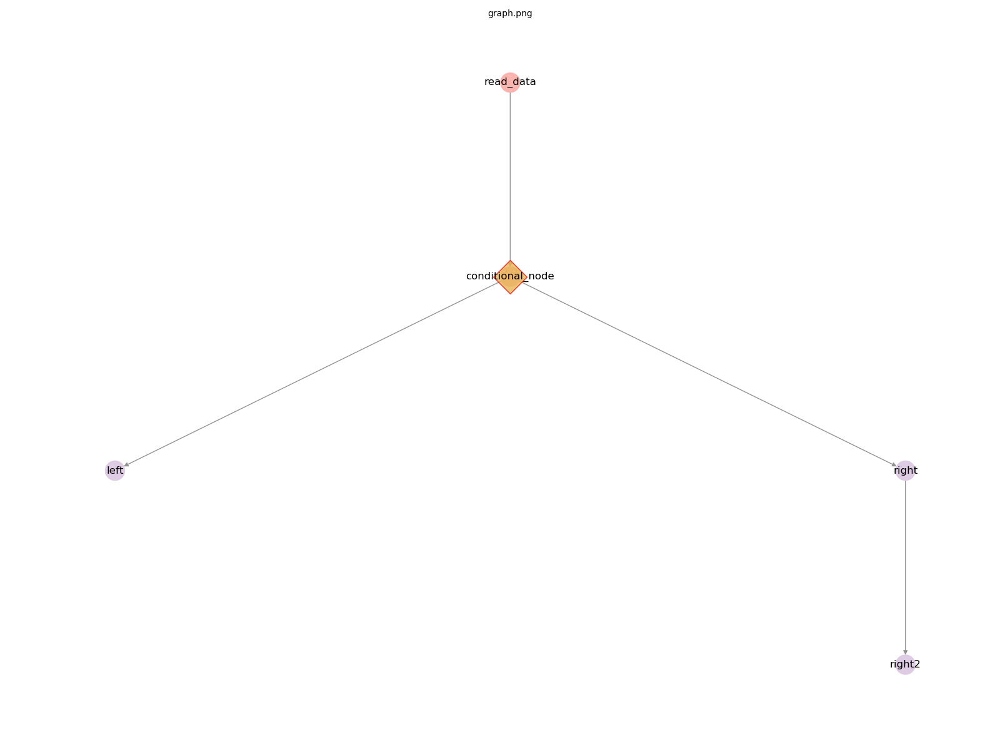

# Developer Notes

`primrose` has been developed with a relatively small, simple, and consistent interface with which to develop your own DAG nodes.

The core concept is that of a `Node`, a single node of a DAG. This is defined with the abstract class `primrose.base.AbstractNode`.

Some example custom nodes can be seen in the default project directory that's created when running `primrose create-project`: `AwesomeReader` and `AwesomeModel`.

There are two defined methods:

## necessary_config(node_config)

Almost all nodes will need some parameterization. A reader needs to from where to read, a model needs to know whether it running in training or eval mode, a writer needs to know where to write and so on.

One of the goals of the `primrose` framework is to catch configuration errors as early as possible, before the job actually starts. For this reason, we have implemented many configuration checks within the `Configuration` class (detailed [here](README_DAG_CONFIG.md)). One of those checks is to check that the nodes have all the information that they need to run. For this reason, we include a `necessary_config(node_config)` method in the Node interface. 

If a `CsvReader` needs to know a filename so that it can perform its task, we explictly tell the `Configuration` object to look for a filename key in the section of configuration that defines that node.

To be explicit, if `CsvReader` returns `set(['filename'])` from `CsvReader.necessary_config()` then if the configuration file has 

```
  "read_data": {
    "class": "CsvReader",
    "filename": "data/tennis.csv",
    "destinations": [
      "encode_and_split"
    ]
  }
```
`Configuration` knows that this is a "good" configuration and it passes its check.

All the parameters, i.e.

```
  {
    "class": "CsvReader",
    "filename": "data/tennis.csv",
    "destinations": [
      "encode_and_split"
    ]
  }
```
is avaliable to the `Node` class via `self.node_config`.
## run(data_object)

The other method in `AbstractNode` is `run(data_object)`. This is the method that implements a node's functionality. It receives the `data_object` which is an instance of `DataObject`, and so has access to all the data from upstream nodes of the DAG. It performs it function, and can (but doesn't have to) add or otherwise modify the data within DataObject and returns it. 

The full interface for `run(data_object)` is

```
  """
      run the node. For a reader, that means read, for a writer that means write etc.

  Args:
      data_object (DataObject): DataObject instance

  Returns:
      (tuple): tuple containing:

          data_object (DataObject): instance of DataObject

          terminate (bool): terminate the DAG?

  """
```
and so it returns not only the data_object but also a flag to tell the `DagRunner` whether it should terminate the whole DAG. For instance, suppose that at the start of DAG, a reader is suppposed to read some data but the dataset it receives is empty. There may be no point doing any of the downstream nodes and so it can flag to stop the whole job by returning terminate=True

## Complete example: sleep
Let's suppose that you wanted to develop a new node whose job was to sleep for 5 seconds. We'll parameterize and externalize the duration as a key in the config.

Your class (ignoring pydocs here for clarity) would look like:

```
from primrose.base.node import AbstractNode
import time

class SleepNode(AbstractNode):

  @staticmethod
  def necessary_config(node_config):
     return set(['duration'])

  def run(self, data_object):
      time.sleep(self.node_config['duration'])
      terminate = False
      return data_object, terminate
```
and that's it. The `primrose` framework takes care of the rest. For better code, you might want to add some checks that duration is numeric, that the duration value is non-negative and so on but you get the idea.

After registering your class (see next section), you can then use it in a configuration files such as as
```

  "sleeptime": {
    "class": "SleepNode",
    "duration": 4.5,
    "destinations": [
      "some_other_node"
    ]
  }
```


## Registering Your Classes
Now that you've written your own classes that implement the `Node` interface, how do your register them given that these nodes are in your project and you are importing `primrose`?

If running `primrose` with a configuration file, all you need to do is set the environment variable `PRIMROSE_EXT_NODE_PACKAGE`. 

When configuration is validated, there is a check to make sure that all classes implement `AbstractNode`. If a class is not already registered, there is an attempt to register by searching through the given `PRIMROSE_EXT_NODE_PACKAGE` for the class name. If there is a match, the class is automatically imported and registered. The variable `PRIMROSE_EXT_NODE_PACKAGE` can be set to a package installed in pip (e.g. `my_nodes`), a python file (e.g. `src/my_nodes/node1.py`), or a directory to a package (e.g. `src/my_nodes`). If you would rather specify the package in your configuration file, you can set the key `class_package` in the `metadata` section. If both values are set, `PRIMROSE_EXT_NODE_PACKAGE` will take precedence.

If you want to specify a specific prefix for a class, you can set the value `class_prefix` in your node config. This class prefix will be appended to the set `PRIMROSE_EXT_NODE_PACKAGE`. This can either be specified in python dot notation (e.g. `src.mynodes`) or a path `src/mynodes.py`. This could be useful if you are importing nodes from multiple packages or from multiple locations.

Here is an example of how your configuration may look if your nodes are in the path `src/mynodes/awesome_node.py`. In the first method, you can just specify `PRIMROSE_EXT_NODE_PACKAGE=src` and primrose will find your custom node:
```
  implementation_config: {
  ...
    read_data: {
      "class": "MyAwesomeNode",
      "destinations": [
        "encode_and_split"
      ]
    }
  ...
  }
```

Alternatively, you can set the `class_package` and/or `class_prefix` variables to explicitly define a class location:
```
  metadata: {
    class_package: "src"
  },
  implementation_config: {
  ...
    read_data: {
      "class": "MyAwesomeNode",
      "class_prefix": "mynodes/awesome_node.py",
      "destinations": [
        "encode_and_split"
      ]
    }
  ...
  }
```

## Conditional Pathing
During machine learning jobs, one often has to make decisions dynamically depending on characteristics of the data at runtime: if there is drift, then retrain the model; if the data is too large to fit in RAM, handle in the cloud; if the detected language is French, use the French model etc. 

One option is to bake this conditional logic within a node. However, another option supported in `primrose` is to have conditional paths in the DAG. That is, if some condition is met at a given node, the `DAGRunner` should follow one or more of the destinations (and their subgraphs) and should ignore one or more other destinations (and their subgraphs). This is more easily explained with a diagram.



In this simple DAG, the reader flows into a node called `conditional_node`. This flows into two destinations: `left` and `right`. This `conditional_node` could flow into both `left` and `right`, as normal and as would be expected. However, in this case, it could signal to the `DAGRunner` that only the `left` path should run and the `right` path (`right` and `right2`) should be dropped from the DAG. It could also signal that only the `right` path should run and the `left` path should be dropped.

How does one develop such nodes? One of the `primrose.base` node types is `AbstractConditionalPath`. These nodes extend `AbstractNode` and so they must implement `run(self, data_object)`. However, they must also implement a method `destinations_to_prune(self)`. If the node does not want to prune a path, it returns `None`. However, if it does want to prune a path it returns a list of one or more of its destinations nodes. In the example above, it could return `['left']`, `['right']` or `['left','right']`.

For any `AbstractConditionalPath`-type node, the `DAGRunner` will call the node's `destinations_to_prune()` *after* `run(self, data_object)`. Thus, it has access to the `data_object` and any processing during the `run` method with which to make the pruning decision.

**Note**: as these decisions are made dynamically at run time, the `DRY_RUN` feature of `primrose` is not able to demonstrate the precise final DAG that will be run. `DRY_RUN` has to assume that *no* DAG pruning will occur.

## Next
Learn more about DataObject: [DataObject](README_DATAOBJECT.md).