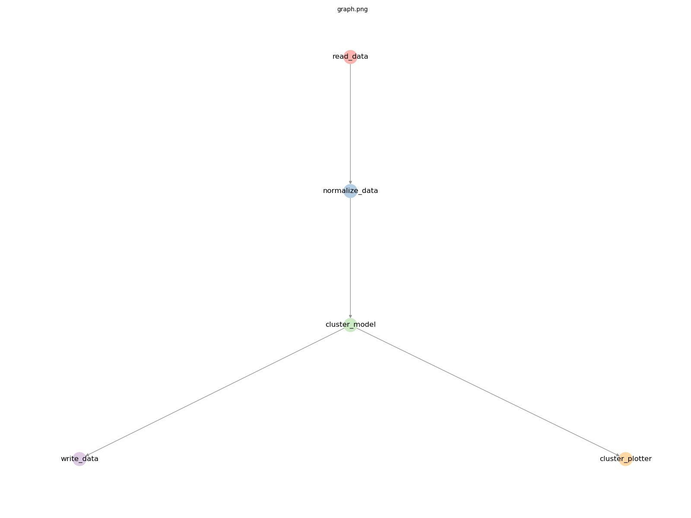
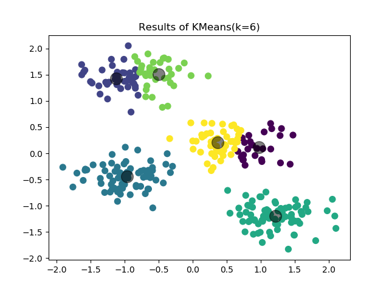

# Getting Started
In this section, we'll run some "Hello world" `primrose` jobs. However, rather than print a string, we'll do some more useful tasks: 
 - run a read-write job (i.e., read data from a source and write it to some sink; that is, an `Extract-Transfer-Load` job)
 - run machine learning models, including clustering and classification

## Your first primrose job
Once you have `primrose` installed, you can now run a job. First you'll need to create your own project directory, by 
using the `primrose` command line as follows:

```
primrose create_project --name <myprojectname>

```

This will create a directory with everything you need to get started. Just navigate into this directory to begin.

### A read write job
Open `config/hello_world_read_write.json`:

```
{
    "implementation_config": {
        "reader_config": {
            "read_data": {
                "class": "CsvReader",
                "filename": "data/tennis.csv",
                "destinations": [
                    "write_output"
                ]
            }
        },
        "writer_config": {
            "write_output": {
                "class": "CsvWriter",
                "key": "data",
                "dir": "cache",
                "filename": "tennis_output.csv"
            }
        }
    }
}
```
There are two tasks:
 - `read_data`: this run an instance of `CsvReader` which loads data from `data/tennis.csv` into a pandas dataframe and sends the data to the next task: `write_output`.
 - `write_output`: this receives the data (associated with a key `data`) and uses an instance of `CsvWriter` to write the data out to `cache/tennis_output.csv`.

It might not be obvious that it is pandas under the hood but otherwise this configuration file should be relatively intuitive.

### Running the job
To run the job, type
 ```
 primrose run --config config/hello_world_read_write.json
 ```
 You should see something similar to:
 ```
 2019-07-23 21:15:09,075 INFO configuration.py __init__: Loading config file at config/hello_world_read_write.json
2019-07-23 21:15:09,081 INFO configuration.py check_sections: OK: all sections are supported operations
2019-07-23 21:15:09,081 INFO configuration.py check_config: OK: all class keys are present
2019-07-23 21:15:09,081 INFO configuration.py check_config: OK: all classes recognized
2019-07-23 21:15:09,081 INFO configuration.py check_config: OK: good necessary_configs
2019-07-23 21:15:09,082 INFO configuration_dag.py create_dag: Checking configuration DAG
2019-07-23 21:15:09,082 INFO configuration_dag.py create_dag: OK: good referential integrity
2019-07-23 21:15:09,082 INFO configuration_dag.py check_connected_components: OK: 1 connected component
2019-07-23 21:15:09,082 INFO configuration_dag.py check_for_cycles: OK: no cycles found
2019-07-23 21:15:09,082 INFO dag_runner.py __init__: Traverser is of class <class 'primrose.dag.config_layer_traverser.ConfigLayerTraverser'>
2019-07-23 21:15:09,083 INFO dag_runner.py filter_sequence: Taking nodes to run from default
2019-07-23 21:15:09,083 INFO dag_runner.py run: received node read_data of type reader_config and class CsvReader
2019-07-23 21:15:09,083 INFO csv_reader.py run: Reading data/tennis.csv from CSV
2019-07-23 21:15:09,109 INFO dag_runner.py run: received node write_output of type writer_config and class CsvWriter
2019-07-23 21:15:09,109 INFO csv_writer.py run: Saving data data to cache/tennis_output.csv
2019-07-23 21:15:09,115 INFO dag_runner.py run: All done. Bye bye!
 ```
That's it. You have run a **primrose** job.

### Examining the output
 The first half of this output is a set of validation checks  against the configuration. You can read more about these checks in [DAG Configurations](README_DAG_CONFIG.md).

 The `Traverser` is some code that determines the order in which the `primrose` nodes are processed. 
 
 Importantly, there are four output lines that show the actual work being done:
 ```
 2019-07-23 21:15:09,083 INFO dag_runner.py run: received node read_data of type reader_config and class CsvReader
2019-07-23 21:15:09,083 INFO csv_reader.py run: Reading data/tennis.csv from CSV
2019-07-23 21:15:09,109 INFO dag_runner.py run: received node write_output of type writer_config and class CsvWriter
2019-07-23 21:15:09,109 INFO csv_writer.py run: Saving data data to cache/tennis_output.csv
```
You should now have a file `cache/tennis_output.csv` that matches the input file `data/tennis.csv`.

## A Machine Learning Job: Clustering
Now, let's do some machine learning. We'll run a basic K-means clustering and plot the clusters.

### Plotting the Graph
Before we examine the configuration, let's plot the graph. type

```
primrose plot --config config/hello_world_cluster_simple_train.json --outfile graph.png
```
This will write an image to `graph.png`



Here we see a `read_data` node feeding into a `normalize_data` node feeding into a `cluster_model` node. The output feeds to `write_data` and also to `cluster_plotter`.

### Examining the configuration
With that background, let's examine the configuration file.
This is `config/hello_world_cluster_simple_train.json
```
{
    "metadata": {

        "explanation": ["this is a minimal Sklearn clustering example in training mode:",
            " * read in some data from CSV",
            " * sklearn.preprocessing.StandardScaler transform the data but no train test split!",
            " * cluster with sklearn.cluster.KMeans",
            " * predict on same training data, appending predictions column to data",
            " * save enriched data to CSV",
            " * plot clusters and save image to disk"]

    },
    "implementation_config": {
        "reader_config": {
            "read_data": {
                "class": "CsvReader",
                "filename": "data/unclustered.csv",
                "destinations": [
                    "normalize_data"
                ]
            }
        },
        "pipeline_config": {
            "normalize_data": {
                "class": "SklearnPreprocessingPipeline",
                "operations": [
                    {"class":"preprocessing.StandardScaler", "columns": ["x1", "x2"], "args": {"with_mean": true, "with_std": true}}
                ],
                "is_training": true,
                "destinations": [
                    "cluster_model"
                ]
            }
        },
        "model_config": {
            "cluster_model":{
                "class": "SklearnClusterModel",
                "mode": "train",
                "X": ["x1","x2"],
                "model": {"class": "cluster.KMeans", "args": {"n_clusters": 6, "random_state": 42}},
                "destinations": [
                    "write_data",
                    "cluster_plotter"
                ]
            }
        },
        "writer_config": {
            "write_data": {
                "class": "CsvWriter",
                "key": "data",
                "dir": "cache",
                "filename": "clustered_output.csv"
            }
        },
        "dataviz_config": {
            "cluster_plotter": {
                "class": "ClusterPlotter",
                "id_col": "cluster_id",
                "filename": "clusters.png",
                "title": "Results of KMeans(k=6)"
            }
        }
    }
}
```
Most of it should be relatively intuitive but let's walk through it.

`read_data` uses a `CsvReader` to read in some data. This fees to `normalize_data`.

`normalize_data` is a pipeline, a preprocessing step. This is going to run `sklearn.preprocessing.StandardScaler` on the columns `x1` and `x2`, scaling to zero mean and unit standard deviation. It is in training mode.

This feeds into `cluster_model` which uses `sklearn.cluster.KMeans` with k=6 (and seed=42) to cluster the data.
That feeds to a `CSvWriter` and to a `ClusterPlotter`. the plotter creates a scatterplot with title "Results of KMeans(k=6)" and saving to `clusters.png`.

Here is the output:



Congratulations. You have now machined-learned in `primrose`!

## A Machine Learning Job with Model Caching: Classification
In this last example, we will train another Sklearn classifier model. However, here, we cache the trained model so that it can be used against a new dataset at a later stage&mdash;i.e., in separate `primrose` job&mdash;in either `predict` or `eval` mode. 

The dataset we are using is Tom Mitchell's play tennis example to illustrate decision trees:


Here, we run two separate `primrose` jobs: 1) train, and 2) predict (or eval). Each job has its own configuration file.

`config/hello_world_classifier_train.json` reads the `tennis` dataset, does a train test split, runs a Sklearn decision tree model in mode `predict`, and writes both the `TransformerSequence` (set of transformation performed on the features) and the `model` to a local cache using `dill`:

```
      ...

      "encode_and_split": {
        "class": "EncodeTrainTestSplit",
        "is_training": true,
        "target_variable": "play",
        "training_fraction": 0.65,
        "seed": 42,
        "destinations": [
          "decision_tree_model",
          "write_encoder"
        ]
      }

      ...

      "write_encoder": {
        "class": "DillWriter",
        "key": "transformer_sequence",
        "dir": "cache",
        "filename": "hello_world_encoder.dill"
      },
      "write_model": {
        "class": "DillWriter",
        "key": "model",
        "dir": "cache",
        "filename": "hello_world_model.dill"
      }
```
A separate configuration file, `config/hello_world_classifier_predict.json` is designed to make predictions using the cached model. (Ideally, we would use a different dataset but we are using the same tennis dataset here for simplicity. ) 

In this configuration, we read the data and the two cached objects:

```
    "reader_config": {
      "read_data": {
        "class": "CsvReader",
        "filename": "data/tennis.csv",
        "destinations": [
          "encode_and_split"
        ]
      },
      "read_model": {
        "class": "DillReader",
        "filename": "cache/hello_world_model.dill",
        "destinations": [
          "decision_tree_model"
        ]
      },
      "read_encoder": {
        "class": "DillReader",
        "filename": "cache/hello_world_encoder.dill",
        "destinations": [
          "encode_and_split"
        ]
      }
    },
```

run through the model with `mode: predict`:

```
      "decision_tree_model": {
        "class": "SklearnClassifierModel",
        "sklearn_classifier_name": "tree.DecisionTreeClassifier",
        "mode": "predict",
        "grid_search_scoring": null,
        "cv_folds": null,
        "destinations": [
          "write_output"],
        "model_parameters": {}
      }
```
and, finally, write out the predictions
```
    "writer_config": {
      "write_output": {
        "class": "CsvWriter",
        "key": "predictions",
        "dir": "cache",
        "filename": "hello_world_predictions.csv"
      }
    }
```

Try running it yourself. First, run
```
   primrose run --config config/hello_world_classifier_train.json
```
and inspect the files in the `cache` folder.

Now run the predict job:

```
   primrose run --config config/hello_world_classifier_predict.json
```
and find the predictions in the `cache` folder.

You can also inspect and run the `config/hello_world_classifier_eval.json` configuration file which produces a number of evaluation metrics to the log file.

You are now set up to design realistic `primrose` runs in a production setting.

## Next
Learn more about `primrose` configurations: [DAG Configurations](README_DAG_CONFIG.md)
