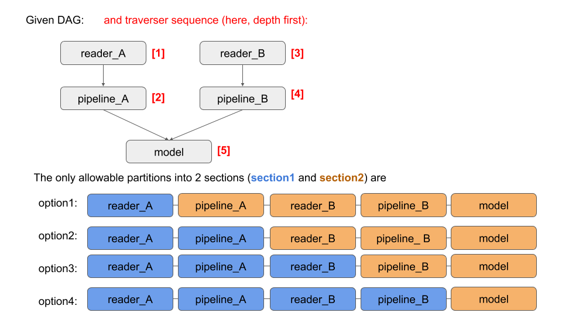

# Configuration Metadata

The metadata section can be used for global settings that may be used by multiple nodes or that apply at the job or DAG level.

Users are free to add whatever keys and configuration they wish in this section. However, there are some existing keys and structures.

In this document, we will cover the following metadata keys:

 - traverser
 - class_package
 - data_object
 - section_registry
 - section_run

For instance, you might have a configuration 

```
{
    "metadata": {

        "traverser": "DepthFirstTraverser",

        "class_package": ["./src", "./sample_project"],

        "data_object": {
            "read_from_cache": false,
            "read_filename": "/tmp/data_object_20190618.dill",

            "write_to_cache": true,
            "write_filename": "/tmp/data_object_20190618.dill"
        },

        "section_registry": [
            "phase1",
            "writer_config"
        ],

        "section_run": [
            "writer_config"
        ]

    },
    "implementation_config": {
        ...
    }
}
```

# traverser key
A DagTraverser is a class that specifies the order in that the nodes of the DAG are visited. The default traverser is called `ConfigLevelTraverser` and was designed for a typical modeling pipeline of 

```
readers --> pipelines --> models --> postprocess --> writers --> success
```
(any of those sections might be missing but the underlying assumption is the inherent order: all readers are run before any pipelines, etc).

If no traverser is defined, `ConfigLevelTraverser` is the Traverser that will be instantiated and used. Importantly, if the `reader --> pipeline --> model --> postprocess --> writer --> success` assmuption is not true, users should use another Traverser: `DepthFirstTraverser`.

This is guaranteed to run with any valid DAG. This traverser is implemented in `primrose`. Users can also supply their own traversers. 

The way users defined what to use is with the `traverser` key in `metadata`. If no key is present, the default traverser. In this case, we specify that we wish to use the `DepthFirstTraverser`:

```
{
    "metadata": {

        "traverser": "DepthFirstTraverser"

    },
    "implementation_config": {
        ...
    }
}
```

# class_package
When creating additional nodes for your projects, you can specify where to look for potential nodes to register, via 

(1) setting the `PRIMROSE_EXT_NODE_PACKAGE` environment variable, or  
(2) specifying the folders in the `metadata` portion of your primrose config via the `class_package` key. 


For example, if all custom nodes are in the `src` folder,
```
├── config
│   ├── my_primrose_config.yml
├── src
│   ├── readers
│   │   ├── reader_node.py
│   ├── pipelines
│   │   ├── pipeline_node.py
```
we can set `PRIMROSE_EXT_NODE_PACKAGE=./src`, or define the primrose config as
```
metadata:
  section_registry:
    - reader_config
    - writer_config
  class_package:
    - './src'

implementation_config:
  reader_config:
    ...
  writer_config:
    ...
```

The latter is particularly useful when mulitple projects are being built off the same primrose package. For example, given the following folder structure
```
├── config
│   ├── primrose_config1.yml
│   ├── primrose_config2.yml
├── src
│   ├── readers
│   │   ├── reader_node.py
│   ├── pipelines
│   │   ├── pipeline_node.py
├── projects
│   ├── sample_project1
│   │   ├── sample_project1_node.py
│   ├── sample_project2
│   │   ├── sample_project2_node.py
```
we can define the primrose config for `sample_project1` as
```
metadata:
  class_package:
    - './src'
    - './projects/sample_project1'

implementation_config:
    ...
```
and the primrose config for `sample_project2` as
```
metadata:
  class_package:
    - './src'
    - './projects/sample_project2'

implementation_config:
    ...
```
This ensures all classes within the `src` and `projects/sample_project{i}` folders are considered when registering nodes specified in the primrose configs.
 
# section_registry key
The default assumption of 
```
readers --> pipelines --> models --> postprocess --> writers --> success
```
correlates with the expectation that the configuration contains corresponding sections: `reader_config`, `pipeline_config`, `model_config` etc. However, what if you want to name the sections that you wish? For instance, perhaps you want `phase1`, `phase2` etc. Well, `primrose` allows you to do that. You just need to tell the configuration what to expect, and that comes from the `section_registry` key of `metadata`:

```
{
    "metadata": {

        "section_registry": [
            "phase1",
            "phase2"
        ]

    },
    "implementation_config": {
        "phase1": {
            ...
        },
        "phase2": {
            ...
        }
    }
}
```
`section_registry` is a list of the top-level keys in the `implementation_config`. You need to list all the keys, otherwise a ConfigurationError will be raised. If you don't provide `section_registry` or you have an empty list, the default `reader_config`, `pipeline_config` etc will be assumed.

Note: sections do not have to contain only one flavor of nodes. They can be any subgraph with any node types.

# section_run key
During development of configuration, it can be useful to run some subset of the DAG. Sure, you could create the reader section, run and test that, and then add in the pipelines. Another approach is to specify the section to run. This is achieved with the `section_run` key in `metadata`.

```
{
    "metadata": {

        "section_registry": [
            "phase1",
            "phase2"
        ],

        "section_run: [
            "phase1"
        ]

    },
    "implementation_config": {
        "phase1": {
            ...
        },
        "phase2": {
            ...
        }
    }
}
```
Here, we have user-defined sections `phase1` and `phase2` (and so we need the `section_registry` key) but we have also used `secton_run` to define that we just want to run `phase1` and then quit.

`section_run` is a list and the sections will be run in the order given in the list.

## section_run / traverser compatability checking
When the `DagRunner` fires up, it will check the configuration to see whether the `section_run` sequence makes sense. For instance, if you were using the default flow assmumption (`reader_config`, `pipeline_config` etc) but provided the following `section_run`:

```
        "section_run: [
            "writer_config",
            "reader_config"
        ]
```
it would raise an Exception because the DAG defines a flow from readers to writers. Thus, make sure that `section_run` defines a sequence where data flows from a section to only later section(s) in the list. 

This is actually tied to the traverser one is using. A partition of the DAG, and ordering of the sections, might make sense with one traverser but not another. The `DagRunner` takes this all into account.

Here is an illustration:



# data_object key
The `DataObject` is the object that is flowed among nodes and stores and keeps track of the data. During development of a DAG, it can be useful to run one section, cache the `DataObject`, check eveything and then run the next section picking up the cached data. This caching can be specified with a `data_object` key in `metadata`. 

The structure is relatively straightforward: 

 - `read_from_cache`: boolean. Before the first node is run, should it use a cached DataObject?
 - `read_filename`: if `read_from_cache`==True, where is the path to the cached object?
 - `write_to_cache`: boolean. After the last node has run, should it cache the DataObject?
 - `write_filename`: if `write_cache`==True, what is the path to write the cached object to?

If `read_from_cache` is true, you must supply a `read_filename` and it must be a valid path (or Exception will be raised). If `read_from_cache` is false, it will ignore the `read_filename` key.

Similarly, if `write_to_cache` is true, you must supply a `write_filename`. If `read_from_cache` is false, it will ignore the `write_filename` key.

Putting this together, you might have configuration:

```
{
    "metadata": {

        "data_object": {
            "read_from_cache": false,
            "read_filename": "/tmp/data_object_20190618.dill",

            "write_to_cache": true,
            "write_filename": "/tmp/data_object_20190618.dill"
        },

    },
    "implementation_config": {
        ...
    }
}
```
which says cache after last step and write to `/tmp/data_object_20190618.dill`.

## section by section development workflow
Putting this together, you might have a two stage development process.

First, run `section1` only and cache the `DataObject` to `/tmp/data_object_20190618.dill`:

```
{
    "metadata": {

        "traverser": "DepthFirstTraverser",

        "data_object": {
            "read_from_cache": false,
            "read_filename": "/tmp/data_object_20190618.dill",

            "write_to_cache": true,
            "write_filename": "/tmp/data_object_20190618.dill"
        },

        "section_registry": [
            "phase1",
            "phase2"
        ],

        "section_run": [
            "phase1"
        ]

    },
    "implementation_config": {
        "phase1": {
            ...
        },
        "phase2": {
            ...
        }
    }
}
```

When you are satisfied with this `phase1` implementation, you can switch the configuration. Here, start with and run `phase2` only, picking up the cached `DataObject` and cache at the end:
```
{
    "metadata": {

        "traverser": "DepthFirstTraverser",

        "data_object": {
            "read_from_cache": true,
            "read_filename": "/tmp/data_object_20190618.dill",

            "write_to_cache": true,
            "write_filename": "/tmp/data_object_20190618.dill"
        },

        "section_registry": [
            "phase1",
            "phase2"
        ],

        "section_run": [
            "phase2"
        ]

    },
    "implementation_config": {
        "phase1": {
            ...
        },
        "phase2": {
            ...
        }
    }
}
```

## Next
Learn about the [command line interface](README_CLI.md).